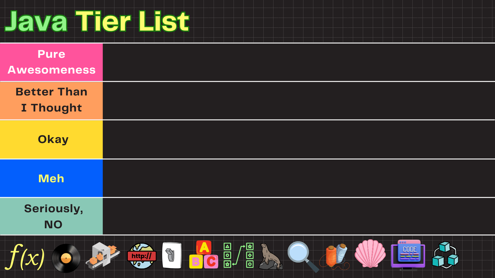

# Java Tier List

<div class="pt-12">
  <span @click="$slidev.nav.next" class="px-2 py-1 rounded cursor-pointer" hover="bg-white bg-opacity-10">
    Let's rank some Java features! <carbon:arrow-right class="inline"/>
  </span>
</div>

---

# Contact Info

Ken Kousen<br>
Kousen IT, Inc.

- ken.kousen@kousenit.com
- http://www.kousenit.com
- http://kousenit.org (blog)
- Social Media:
  - [@kenkousen](https://twitter.com/kenkousen) (Twitter)
  - [@kousenit.com](https://bsky.app/profile/kousenit.com) (Bluesky)
  - [https://www.linkedin.com/in/kenkousen/](https://www.linkedin.com/in/kenkousen/) (LinkedIn)
- *Tales from the jar side* (free newsletter)
  - https://kenkousen.substack.com
  - https://youtube.com/@talesfromthejarside
- Source code: https://github.com/kousen/java_latest

---



---

# https://youtu.be/RuMogS3ycKs

<Youtube id="RuMogS3ycKs" width="640" height="360" />

*This presentation is based on the detailed tier list breakdown in the video above*

---

# Java Functional Features (JDK 8)

<div style="position: absolute; top: 20px; right: 20px; opacity: 0.2;">
  
</div>

<v-clicks>

- Completely transformed Java programming
- Game changer for collections processing
- Enabled functional programming paradigms
- Industry-wide adoption

</v-clicks>

```java
// Lambda expressions
names.forEach(name -> System.out.println(name));

// Method references
names.forEach(System.out::println);

// Streams API
List<Integer> evens = IntStream.range(1, 100)
    .filter(n -> n % 2 == 0)
    .boxed()
    .collect(Collectors.toList());
```


---

# Static And Default Methods In Interfaces (JDK 8)

<div style="position: absolute; top: 20px; right: 20px; opacity: 0.2;">
  
</div>

<v-clicks>

- Solved interface evolution problem
- Enables backward compatibility
- Makes interfaces more flexible
- Critical for API designers

</v-clicks>

```java
public interface Calculator {
    // Default method
    default double sqrt(double x) {
        return Math.sqrt(x);
    }
    
    // Static method
    static double add(double a, double b) {
        return a + b;
    }
}

class BasicCalc implements Calculator {
    // Inherits sqrt() implementation
}
```


---

# Optional (JDK 8)

<div style="position: absolute; top: 20px; right: 20px; opacity: 0.2;">
  
</div>

<v-clicks>

- Good concept, mixed reception
- Makes null handling explicit
- Often misused (Optional parameters, fields)
- Better than null, but adds verbosity

</v-clicks>

```java
// Optional way - explicit about nullability
Optional<String> optional = Optional.ofNullable(getValue());
optional.map(String::toUpperCase)
        .ifPresent(System.out::println);

// Return type clarity
public Optional<User> findUserById(Long id) {
    return Optional.ofNullable(userRepository.find(id));
}
```


---

# Collection Factory Methods (JDK 9)

<div style="position: absolute; top: 20px; right: 20px; opacity: 0.2;">
  
</div>

<v-clicks>

- Massive quality of life improvement
- Immutable by default (safer)
- Concise syntax
- No external libraries needed

</v-clicks>

```java
// Concise and immutable
List<String> langs = List.of("Java", "Python", "Kotlin");
Set<Integer> nums = Set.of(1, 2, 3, 4, 5);
Map<String, Integer> scores = Map.of("Alice", 95, "Bob", 87);

// For many entries
Map<String, String> config = Map.ofEntries(
    Map.entry("host", "localhost"),
    Map.entry("port", "8080")
);
```

**Full examples:** `collections/FactoryMethodDemo.java`


---

# Local Variable Type Inference (JDK 10 and 11)

<div style="position: absolute; top: 20px; right: 20px; opacity: 0.2;">
  
</div>

<v-clicks>

- Reduces boilerplate nicely
- Still strongly typed (not like JavaScript!)
- Great for complex generic types
- Some debate on readability

</v-clicks>

```java
// With var - cleaner, still strongly typed
var userScores = new HashMap<String, List<Integer>>();
var outputStream = new ByteArrayOutputStream();
var name = "Java";  // String
var count = 42;     // int

// Works great with streams
var result = list.stream()
    .filter(s -> s.length() > 5)
    .map(String::toUpperCase)
    .collect(Collectors.toList());
```


---

# HTTP Client (JDK 11)

<div style="position: absolute; top: 20px; right: 20px; opacity: 0.2;">
  
</div>

<v-clicks>

- Modern replacement for HttpURLConnection
- Built-in HTTP/2 support
- Both sync and async APIs
- No more Apache HttpClient dependency

</v-clicks>

```java
// Modern, fluent API
HttpClient client = HttpClient.newHttpClient();
HttpRequest request = HttpRequest.newBuilder()
    .uri(URI.create("https://api.github.com/users/octocat"))
    .header("Accept", "application/json")
    .GET()
    .build();

// Both sync and async supported
HttpResponse<String> response = client.send(request, 
    HttpResponse.BodyHandlers.ofString());
```

**Full examples:** `http/AstroClient.java`, `http/JokeClient.java`


---

# JShell (JDK 9)

<div style="position: absolute; top: 20px; right: 20px; opacity: 0.2;">
  
</div>

<v-clicks>

- Great for learning and prototyping
- Perfect for conference demos
- Useful for testing small code snippets
- Not widely adopted in practice

</v-clicks>

```java
// Interactive Java REPL
jshell> int x = 10
x ==> 10

jshell> x * x
$2 ==> 100

jshell> List.of("Alice", "Bob")
$3 ==> [Alice, Bob]

jshell> /methods
|    int square(int)
```


---

# Single File Code Execution (JDK 11)

<div style="position: absolute; top: 20px; right: 20px; opacity: 0.2;">
  
</div>

<v-clicks>

- Great for scripts and learning
- Lowers barrier to entry
- Perfect for small utilities
- Makes Java competitive with Python/Ruby for scripts

</v-clicks>

```java
// Hello.java
public class Hello {
    public static void main(String[] args) {
        System.out.println("Hello, " + args[0] + "!");
    }
}
```

```bash
# Direct execution - no compilation step!
java Hello.java World
# Output: Hello, World!
```


---

# Enhanced Switch Statement (JDK 14)

<div style="position: absolute; top: 20px; right: 20px; opacity: 0.2;">
  
</div>

<v-clicks>

- Finally makes switch useful!
- No fall-through bugs
- Can be an expression (returns value)
- Multiple case labels

</v-clicks>

```java
// New switch expression - concise and safe
String result = switch (day) {
    case MONDAY, FRIDAY -> "Work day";
    case SATURDAY, SUNDAY -> "Weekend";
    default -> "Midweek";
};
```

**Full examples:** `enhancedswitch/DaysInMonth.java`


---

# Text Blocks (JDK 15)

<div style="position: absolute; top: 20px; right: 20px; opacity: 0.2;">
  
</div>

<v-clicks>

- Massive quality of life improvement
- Perfect for JSON, SQL, HTML
- No more escape sequences
- Preserves formatting

</v-clicks>

```java
// Text blocks - clean and readable
String json = """
    {
      "name": "Alice",
      "age": 30
    }
    """;

String sql = """
    SELECT id, name, email
    FROM users
    WHERE active = true
    """;
```

**Full examples:** `textblocks/TextBlocks.java`


---

# Records (JDK16)

<div style="position: absolute; top: 20px; right: 20px; opacity: 0.2;">
  
</div>

<v-clicks>

- Eliminates data class boilerplate
- Immutable by default
- Pattern matching friendly
- Perfect for DTOs and value objects

</v-clicks>

```java
// Record - one line!
public record Point(int x, int y) {}

// Usage
var p = new Point(3, 4);
System.out.println(p.x());  // 3
System.out.println(p);      // Point[x=3, y=4]
```

**Full examples:** `records/Person.java`, `records/Product.java`


---

# Pattern Matching - instanceof Basics (JDK 16)

<div style="position: absolute; top: 20px; right: 20px; opacity: 0.2;">
  
</div>

<v-clicks>

- No more explicit casting
- Variable automatically typed and scoped
- Reduces boilerplate significantly
- Foundation for more pattern features

</v-clicks>

```java
// Old way - verbose and error-prone
if (obj instanceof String) {
    String s = (String) obj;
    System.out.println(s.toUpperCase());
}

// Pattern matching - clean and safe
if (obj instanceof String s) {
    System.out.println(s.toUpperCase());
}
```

**Full examples:** `patternmatching/UseShapes.java`

---

# Pattern Matching - instanceof Advanced (JDK 16)

<v-clicks>

- Works with complex conditions
- Variable scope limited to true branch
- Combines type checking with logic
- Eliminates common casting bugs

</v-clicks>

```java
// Complex conditions with pattern variable
if (obj instanceof String s && s.length() > 5) {
    System.out.println("Long string: " + s);
}

// Multiple checks in same method
if (obj instanceof Integer i && i > 0) {
    System.out.println("Positive integer: " + i);
} else if (obj instanceof String s && !s.isEmpty()) {
    System.out.println("Non-empty string: " + s);
}
```

**Full examples:** `patternmatching/UseShapes.java`

---

# Pattern Matching - Type Patterns (JDK 21)

<v-clicks>

- Type patterns in switch expressions
- Guarded patterns with `when`
- More flexible than traditional switch
- Eliminates casting

</v-clicks>

```java
// Switch with type patterns and guards
String format(Object obj) {
    return switch (obj) {
        case Integer i -> "int " + i;
        case String s when s.length() > 5 -> "long string: " + s;
        case String s -> "short string: " + s;
        default -> "unknown";
    };
}
```

**Full examples:** `patternmatching/UseShapes.java`

---

# Pattern Matching - Null Handling (JDK 21)

<v-clicks>

- Null handling in switch expressions
- No more NullPointerException surprises
- Explicit null cases
- Cleaner than separate null checks

</v-clicks>

```java
// Null can be handled directly in switch
String handleNulls(Object obj) {
    return switch (obj) {
        case null -> "was null";
        case String s -> "string: " + s;
        case Integer i -> "number: " + i;
        default -> "something else";
    };
}
```

**Full examples:** `patternmatching/UseShapes.java`

---

# Pattern Matching - Record Patterns (JDK 21)

<v-clicks>

- Record patterns for decomposition
- Extract values directly in switch
- Cleaner than accessor methods
- Direct access to record components

</v-clicks>

```java
// Record patterns - destructuring
String processPoint(Object obj) {
    return switch (obj) {
        case Point(int x, int y) -> "point at (" + x + "," + y + ")";
        default -> "not a point";
    };
}

// Simpler than using accessor methods
String oldWay(Object obj) {
    return switch (obj) {
        case Point p -> "point at (" + p.x() + "," + p.y() + ")";
        default -> "not a point";
    };
}
```

**Full examples:** `patternmatching/UseShapes.java`

---

# Pattern Matching - Nested Records (JDK 21)

<v-clicks>

- Works with nested records
- Destructure complex data structures
- Extract multiple levels at once
- Powerful for data processing

</v-clicks>

```java
// Nested record patterns
String processShape(Object obj) {
    return switch (obj) {
        case Rectangle(Point(int x, int y), int width, int height) -> 
            "Rectangle at (" + x + "," + y + ") size " + width + "x" + height;
        default -> "unknown shape";
    };
}

// Partial destructuring - only what you need
String getX(Object obj) {
    return switch (obj) {
        case Rectangle(Point(int x, var _), var _, var _) -> "x = " + x;
        default -> "no x coordinate";
    };
}
```

**Full examples:** `patternmatching/UseShapes.java`


---

# Sealed Classes - Definition (JDK 17)

<div style="position: absolute; top: 20px; right: 20px; opacity: 0.2;">
  
</div>

<v-clicks>

- Great for domain modeling
- Enables exhaustive pattern matching
- Better than visitor pattern
- Limited use cases but powerful when needed

</v-clicks>

```java
// Define allowed subclasses explicitly
public sealed interface Shape 
    permits Circle, Rectangle, Triangle {}

// Alternative syntax - classes in same file
public sealed class Animal 
    permits Dog, Cat, Bird {}
```

**Full examples:** `sealed/Shape.java`, `sealed/Circle.java`

---

# Sealed Classes - Permitted Classes (JDK 17)

<v-clicks>

- Each permitted class must be final, sealed, or non-sealed
- Compiler enforces the permitted list
- All subclasses must be in same module
- Clean hierarchy control

</v-clicks>

```java
// Each permitted class must choose its modifier
public final class Circle implements Shape {
    private final double radius;
    
    public Circle(double radius) { this.radius = radius; }
    public double radius() { return radius; }
}
```

**Full examples:** `sealed/Circle.java`, `sealed/Rectangle.java`

---

# Sealed Classes - Modifier Options (JDK 17)

<v-clicks>

- `final` - cannot be extended further
- `sealed` - can specify its own permitted subclasses
- `non-sealed` - reopens for extension
- Choose based on your design needs

</v-clicks>

```java
// Final class - end of hierarchy
public final class Triangle implements Shape {
    private final double base, height;
    // constructor, getters...
}

// Sealed class - extends the hierarchy
public sealed class Polygon implements Shape 
    permits Triangle, Pentagon, Hexagon {}

// Non-sealed class - reopens for extension
public non-sealed class FlexibleShape implements Shape {}
```

**Full examples:** `sealed/` directory

---

# Sealed Classes - Pattern Matching (JDK 17)

<v-clicks>

- Compiler knows all possible subtypes
- Enables exhaustive switch expressions
- No default case needed
- Compile-time safety for domain models

</v-clicks>

```java
// Exhaustive pattern matching - no default needed!
double area(Shape shape) {
    return switch (shape) {
        case Circle c -> Math.PI * c.radius() * c.radius();
        case Rectangle r -> r.width() * r.height();
        case Triangle t -> 0.5 * t.base() * t.height();
    };
}

// Compiler error if you miss a case
String describe(Shape shape) {
    return switch (shape) {
        case Circle c -> "Circle with radius " + c.radius();
        // Compile error: Rectangle and Triangle not covered!
    };
}
```

**Full examples:** `sealed/` directory


---

# Virtual Threads (JDK 21)

<div style="position: absolute; top: 20px; right: 20px; opacity: 0.2;">
  
</div>

<v-clicks>

- Game changer for concurrent apps
- Lightweight threads (use 1000x less memory)
- Simple thread-per-request model returns
- Makes reactive programming less necessary

</v-clicks>

```java
// Virtual threads - millions of threads!
try (var executor = Executors.newVirtualThreadPerTaskExecutor()) {
    IntStream.range(0, 10_000).forEach(i -> {
        executor.submit(() -> {
            Thread.sleep(1000);
            System.out.println("Task " + i);
        });
    });
}  // Handles 10,000 concurrent tasks easily!

// Simple virtual thread
Thread.ofVirtual().start(() -> {
    System.out.println("Hello from virtual thread!");
});
```

**Full examples:** `virtualthreads/VirtualThreadsDemo.java`


---

# The Module System - Overview (JDK 9)

<div style="position: absolute; top: 20px; right: 20px; opacity: 0.2;">
  
</div>

<v-clicks>

- Controversial and often skipped
- Good: Strong encapsulation, explicit dependencies
- Bad: Complex migration, tooling issues
- Most projects still use classpath

</v-clicks>

```java
// module-info.java - defines a module
module com.myapp {
    requires java.base;  // implicit
    requires java.sql;
    requires spring.boot;
    
    exports com.myapp.api;
    exports com.myapp.model;
    
    opens com.myapp.model to jackson.databind;
}
```

---

# The Module System - Build & Runtime (JDK 9)

<v-clicks>

- Compilation requires module-path instead of classpath
- Running modules uses different syntax
- Tools and IDEs have varying support
- Migration from classpath can be challenging

</v-clicks>

```bash
# Compilation with modules
javac -d out \
      --module-path libs \
      module-info.java \
      src/**/*.java

# Running a modular application
java --module-path out:libs \
     --module com.myapp/com.myapp.Main

# Mixed mode (modules + classpath)
java --module-path mods \
     --class-path libs/*.jar \
     --module com.myapp/com.myapp.Main
```


---

# Sequenced Collections (JDK 21)

<v-clicks>

- Fills a real gap in collections
- Unified API for ordered collections  
- No more list.get(list.size()-1)
- Natural addition to the API

</v-clicks>

```java
// New interfaces with first/last access
SequencedCollection<String> list = new ArrayList<>();
list.add("first");
list.add("last");

// Direct access to first and last
String first = list.getFirst();  // "first"
String last = list.getLast();    // "last"

// Reversed view
SequencedCollection<String> reversed = list.reversed();

// Works with LinkedHashSet, LinkedHashMap too
```

---

# Unnamed Variables & Patterns (JDK 22)

<v-clicks>

- Nice quality of life feature
- Makes intent clearer
- Reduces unused variable warnings
- Common in other languages

</v-clicks>

```java
// Ignore values you don't need with _
try {
    int result = someMethod();
} catch (Exception _) {  // Don't care about exception
    System.out.println("Failed");
}

// In loops - just counting
for (int _ : collection) {
    count++;
}

// Pattern matching - only care about x
switch (obj) {
    case Point(int x, _) -> System.out.println("x = " + x);
}
```

---

# Simple Web Server (JDK 18)

<v-clicks>

- Handy for development
- Great for prototyping and testing
- Replaces python -m http.server
- Not for production use

</v-clicks>

```bash
# Start a web server in current directory
$ jwebserver
Binding to loopback by default. For all interfaces use "-b 0.0.0.0".
Serving /current/directory and subdirectories on 127.0.0.1 port 8000

# Custom port and directory
$ jwebserver -p 3000 -d /path/to/files

# Or programmatically
```

```java
var server = SimpleFileServer.createFileServer(
    new InetSocketAddress(8080),
    Path.of("/www"),
    OutputLevel.VERBOSE
);
server.start();
```

---

# Foreign Function & Memory API - Overview (JDK 22)

<v-clicks>

- Powerful but niche
- Replaces JNI (finally!)
- Better performance than JNI
- Complex API, steep learning curve

</v-clicks>

```java
// Call C functions from Java - no JNI needed!
Linker linker = Linker.nativeLinker();
SymbolLookup stdlib = linker.defaultLookup();

// Link to C's strlen function
MethodHandle strlen = linker.downcallHandle(
    stdlib.find("strlen").orElseThrow(),
    FunctionDescriptor.of(ValueLayout.JAVA_LONG, 
                         ValueLayout.ADDRESS)
);
```

---

# Foreign Function & Memory API - Usage (JDK 22)

<v-clicks>

- Safe memory management with Arena
- Automatic cleanup of native memory
- Type-safe function descriptors
- Better than unsafe operations

</v-clicks>

```java
// Using the linked function safely
try (Arena arena = Arena.ofConfined()) {
    // Allocate native memory for string
    MemorySegment str = arena.allocateUtf8String("Hello!");
    
    // Call the C function
    long len = (long) strlen.invoke(str);
    System.out.println("Length: " + len);  // Output: 6
}  // Memory automatically freed

// Another example - calling system time
MethodHandle time = linker.downcallHandle(
    stdlib.find("time").orElseThrow(),
    FunctionDescriptor.of(ValueLayout.JAVA_LONG,
                         ValueLayout.ADDRESS)
);
long currentTime = (long) time.invoke(MemorySegment.NULL);
```

---

# Structured Concurrency (Preview)

<v-clicks>

- Solves real concurrency pain points
- Better error handling
- Automatic cancellation
- Works great with virtual threads

</v-clicks>

```java
// Structured concurrency - threads as a unit
try (var scope = new StructuredTaskScope.ShutdownOnFailure()) {
    Future<String> user = scope.fork(() -> fetchUser());
    Future<Integer> order = scope.fork(() -> fetchOrder());
    
    scope.join();           // Wait for all
    scope.throwIfFailed();  // Propagate errors
    
    return new Response(user.resultNow(), order.resultNow());
}  // Automatically cancels any running tasks
```

---

# Stream Gatherers - Window Operations (JDK 24)

<v-clicks>

- Extends Streams API with custom intermediate operations
- Enables stateful transformations
- Process elements in groups or windows
- More flexible than traditional collectors

</v-clicks>

```java
// Fixed window gatherer - non-overlapping groups
List<List<Integer>> windows = Stream.of(1, 2, 3, 4, 5, 6)
    .gather(Gatherers.windowFixed(3))
    .toList();  
// Result: [[1, 2, 3], [4, 5, 6]]

// Sliding window gatherer - overlapping groups
List<List<Integer>> sliding = Stream.of(1, 2, 3, 4, 5)
    .gather(Gatherers.windowSliding(3))
    .toList();  
```

**Full examples:** `streams/StreamGatherersTest.java`, `exercises/solutions/StreamGatherersTest.java`

---

# Stream Gatherers - Fold & Scan (JDK 24)

<v-clicks>

- Stateful reduction operations
- Fold reduces to single value
- Scan emits intermediate results
- Similar to reduce but more flexible

</v-clicks>

```java
// Fold gatherer - reduces to single value
String concatenated = Stream.of("a", "b", "c")
    .gather(Gatherers.fold(() -> "", String::concat))
    .findFirst()
    .orElse("");  // "abc"

// Scan gatherer - emits running totals
List<Integer> runningSum = Stream.of(1, 2, 3, 4, 5)
    .gather(Gatherers.scan(() -> 0, Integer::sum))
    .toList();
// Result: [1, 3, 6, 10, 15]
```

**Full examples:** `streams/StreamGatherersTest.java`, `exercises/solutions/StreamGatherersTest.java`

---

# Stream Gatherers - Custom Basics (JDK 24)

<v-clicks>

- Create your own intermediate operations
- Stateful transformations with custom logic
- Implement complex stream processing patterns
- Reusable across different stream pipelines

</v-clicks>

```java
// Custom gatherer - distinct by property
Gatherer<Person, ?, Person> distinctByName = 
    Gatherer.of(
        HashSet::new,  // Initial state supplier
        (state, element, downstream) -> {
            if (state.add(element.name())) {
                return downstream.push(element);
            }
            return true;  // Continue processing
        }
    );
```

**Full examples:** `streams/StreamGatherersTest.java`, `exercises/solutions/StreamGatherersTest.java`

---

# Stream Gatherers - Conditional Processing (JDK 24)

<v-clicks>

- Control when to stop processing
- Implement take-while patterns with state
- Build conditional stream termination
- More flexible than `takeWhile`

</v-clicks>

```java
// Take elements until sum exceeds limit
Gatherer<Integer, ?, Integer> takeUntilSum(int limit) {
    return Gatherer.ofSequential(
        () -> new int[]{0},  // sum accumulator
        (sum, num, downstream) -> {
            sum[0] += num;
            return sum[0] <= limit ? downstream.push(num) : false;
        }
    );
}
```

**Full examples:** `streams/StreamGatherersTest.java`, `exercises/solutions/StreamGatherersTest.java`

---

# Stream Gatherers - Windowing Operations (JDK 24)

<v-clicks>

- Group elements by time or other criteria
- Maintain complex state during processing
- Build powerful batch processing
- Useful for event stream processing

</v-clicks>

```java
// Batch elements by time window
Gatherer<Event, ?, List<Event>> timeWindow(Duration window) {
    return Gatherer.ofSequential(
        () -> new ArrayList<>(),
        (batch, event, downstream) -> {
            if (!batch.isEmpty() && 
                Duration.between(batch.get(0).time(), event.time())
                       .compareTo(window) > 0) {
                downstream.push(new ArrayList<>(batch));
                batch.clear();
            }
            batch.add(event);
            return true;
        }
    );
}
```

**Full examples:** `streams/StreamGatherersTest.java`, `exercises/solutions/StreamGatherersTest.java`

---

# String Templates (Preview - Removed in JDK 23)

<v-clicks>

- Withdrawn for redesign
- Shows Java's commitment to getting it right
- May return in future (Java 26+?)

</v-clicks>

```java
// Was in preview JDK 21-22, removed in 23
// The syntax was:
String name = "World";
String message = STR."Hello, \{name}!";  // "Hello, World!"

// With expressions
int x = 10, y = 20;
String calc = STR."\{x} + \{y} = \{x + y}";  // "10 + 20 = 30"

// SQL template processor (the dream)
PreparedStatement ps = SQL."SELECT * FROM users WHERE id = \{userId}";
```

---

# Thank You!

<div class="text-center">

## Questions?

<div class="pt-12">
  <span class="text-6xl"><carbon:logo-github /></span>
</div>

**Kenneth Kousen**  
*Author, Speaker, Java & AI Expert*

[kousenit.com](https://kousenit.com) | [@kenkousen](https://twitter.com/kenkousen)

</div>
